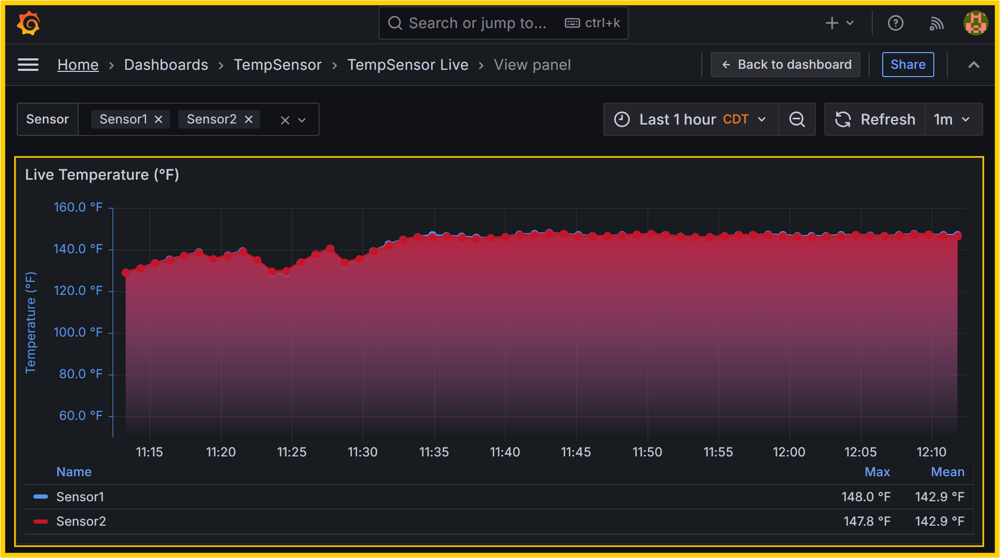
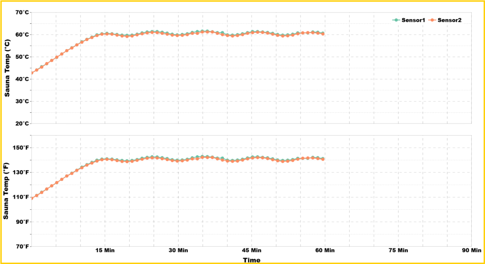
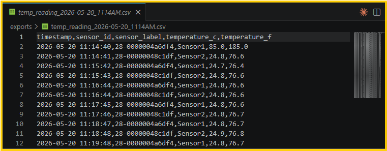

Home

# DS18B20 TempSensor → Grafana & Database

## Why This Project?

**The problem:** Manual heating performance tests miss trends and data points, involve cumbersome record keeping, lack historical data for comparison, and use non-standardized data formats and collection intervals, among a few critical problems.

**The solution:** Fully automated, consistent, and repeatable data collection, live visualization, long-term storage, and retrieval.

| Goal | Approach |
|------|----------|
| No blind spots and pattern recognition | Live **Grafana** dashboards |
| Automated & repeatable data workflow | **DS18B20** sensor probes to a database using Docker |
| Consistent formatting | Timestamped **CSV** data export with consistent format |
| Long-term data retention and access | **Django WebApp** → **PostgreSQL** |

### Deliverables

- “what’s happening now?” via Live charts (Grafana)
- “what happened last month?” via WebApp-based data access from the database (PostgreSQL)

## Implementation Details (How?)


Two stacks:

| Part | Role  | Guide |
|------|------|-------|
| **[SensorDataCollector](SensorDataCollector/)** | Live visualization and data export (CSV) | [README](SensorDataCollector/README.md) |
| **[WebApp](WebApp/)** | Import, browse, archive  | [README](WebApp/README.md) |


```
DS18B20 ──► MQTT ──► InfluxDB ──► Grafana        (live)
    └──► CSV ──► Django WebApp ──► PostgreSQL    (archive)
```

# Results 

### 1. Live Data & Custom Plots






### 2. Data Export



### 3. WebApp


---

## Quick start

```bash
cd SensorDataCollector && cp .env.example .env && make startReadSensor   # Grafana: :3000
cd WebApp && cp .env.example .env && make startwebapp                    # WebApp: :8000
```


## Documentation Links

| Topic | Guide |
|-------|-------|
| Collector (DS18B20, MQTT, Grafana) | [SensorDataCollector/README.md](SensorDataCollector/README.md) |
| WebApp (Django, PostgreSQL, import) | [WebApp/README.md](WebApp/README.md) |
| CSV Data Import to Database | [WebApp/docs/CSV_IMPORT.md](WebApp/docs/CSV_IMPORT.md)|
| Docker Hub · CI/CD | [collector](SensorDataCollector/docs/DOCKER_HUB.md) · [webapp](WebApp/docs/DOCKER_HUB.md) · [CI/CD](docs/CI_CD.md) |

## License

[MIT License](LICENSE) — Copyright (c) 2026 [Bek Kobro](https://bekcsys.com/about). [Authors](SensorDataCollector/docs/AUTHORS.md).
